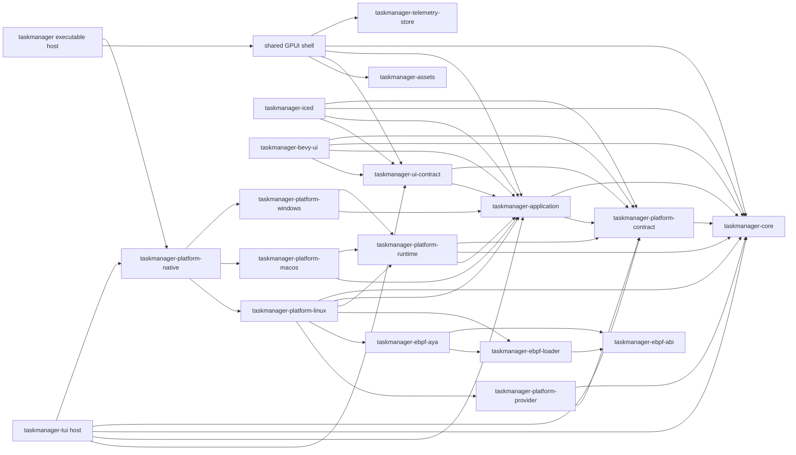

# ADR-005: Multi-crate functional architecture

Status: accepted

## Decision

TaskForest uses a ports-and-adapters workspace. The Linux GPUI application remains the
production path. Framework-neutral crates define commands, state transitions, ports,
and presentation semantics so GPUI and the terminal adapter share one vocabulary and
can converge on the same application behavior without importing one another.

Dependencies only point inward. `taskmanager-core` owns identity, failure and source
truth and does not depend on port/envelope abstractions, an application, platform
adapter, or frontend. `taskmanager-platform-contract` depends inward on core and adds
only capability, correlation, provider-failure, snapshot-wrapper and port contracts.
`taskmanager-application` cannot depend on GPUI, a terminal library, SVG rendering,
`/proc`, `/sys`, or platform commands.

The core package conventionally owns its implementation under
`crates/taskmanager-core/src/core.rs` and `crates/taskmanager-core/src/core/`. The root
package contains no duplicate core tree and does not forward the core or application
surface. Every frontend imports shared facts and platform contracts from their actual
owner crates; no `taskmanager-application::model` compatibility address exists.

## Responsibility boundaries

- `taskmanager-core`: platform-neutral facts, stable provider/device identities,
  completed-operation failures, source truth, typed availability, typed control
  intents/outcomes, lifecycle policy, parsers, and pure read-model
  assembly. It owns no native collector/provider implementation.
- `taskmanager-telemetry-store`: bounded, gap-aware time-series read model plus
  a separately constructed correlated-ingestion capability. It owns no pause,
  interval, provider, native I/O, or application correlation policy.
- `taskmanager-platform-contract`: payload-free capability IDs, request/event
  envelopes, provider failures, composite snapshot wrappers, and generic non-blocking
  port traits. Core identity/failure/source primitives remain imported from core.
- `taskmanager-application`: semantic commands, shortcut routing, functional state,
  use cases, domain request/event payloads, request correlation, validated
  `Duration`-based telemetry refresh policy, and application-owned projections. It
  owns what the product does, not how a window or operating system performs it.
- `taskmanager-platform-provider`: platform-neutral blocking provider SPI, split by
  system/process/service/environment/integration/storage/sensor/power capability
  domains. It owns no OS discovery, command, vendor, frontend, or release-SKU policy.
- `taskmanager-platform-runtime`: application-typed bounded lanes, request validation
  and correlation, capability health, fair control/observation event delivery, and
  reusable target-keyed runtime state. It owns no OS provider implementation, native
  path/command, platform selection, frontend, or hardware feature.
- `taskmanager-platform-linux`: Linux implementations and blocking workers. It adapts
  existing managers without leaking paths, command stderr, or errno strings upward.
- `taskmanager-platform-macos` / `taskmanager-platform-windows`: physical native
  adapter composition and OS config-path ownership. Until real providers arrive
  they reuse runtime's capability-absent handle instead of manufacturing facts.
- `taskmanager-platform-native`: target-specific selection of exactly one physical
  native OS adapter for executable hosts; it owns no runtime, config path, hardware,
  vendor backend logic, or forwarded shared type surface.
- `taskmanager-ui-contract`: localized message keys, semantic `IconId`, command
  descriptors, and frontend-neutral presentation contracts.
- `taskmanager-assets`: embedded, tintable GPUI SVGs and their asset source.
- `taskmanager-tui`: Ratatui renderer, Crossterm runtime, deterministic demo fixture,
  and native-platform composition. It owns no provider or direct operating-system I/O.
- frontends: native event translation, focus handles, layout, theme, SVG/Unicode
  rendering, pointer hover, scroll viewport, and framework lifecycle.

## Native runtime rule

`PlatformHandle` is assembled from immutable domain construction groups
(`SystemFacets`, `ProcessFacets`, `ServiceFacets`, `EnvironmentFacets`,
`IntegrationFacets`, `StorageFacets`, `SensorFacets`, and `PowerFacets`) plus one
correlated event port and capability catalog. The groups contain optional,
independently composable capability request ports; they do not share request enums,
providers, queues, or availability.
`PlatformClient` owns request IDs and exposes one submission method per concrete
facet request. Multi-capability refresh is application use-case orchestration, not an
aggregate request type or runtime queue.

`LinuxPlatformRuntime` consumes a domain-grouped `LinuxProviderRegistry` whose trait
interfaces come from `taskmanager-platform-provider`. It injects Linux provider IDs,
wall clock, and provider execution closures into `taskmanager-platform-runtime`;
Linux paths, commands, registries, and vendor discovery never enter the shared
runtime. Linux converts optional bindings to non-optional complete lanes before
starting workers; composition drift is returned to the executable host as a
structured error and cannot leak a ghost handle. Every blocking capability has its
own bounded lane. Observation and control are separated
when they differ in latency or availability: hardware inventory, process
list/telemetry/affinity/control, service inventory/dependencies/control/log
snapshot/log stream, startup and session inventory/control, telemetry
host/CPU/memory/storage/network/GPU observation, command launch/resource reveal/URL open, desktop appearance,
filesystem health, sensors, power supplies, and SMART. `/proc`, `/sys`, hardware
detection, desktop preference commands/files, native commands, and provider probing
run only inside those lanes.

The shared runtime event publisher emits `EventEnvelope<PlatformEvent>` with request correlation,
capability, provider, sequence, timestamp, and typed operation failure. Both successful
correlated events and detached `OperationFailure` values retain that same authoritative
runtime sequence. The
application bounds drain work with `PlatformEventBatch`, but every member remains a
typed correlated domain event. GPUI and TUI consume those events directly; there is no
second `UiDataUpdate` union or provider interface hidden in the batch.

Accepted service detail/control and Startup/Session control operations publish a
typed domain outcome even when their provider fails; provider health is recorded
independently in the capability catalog. This prevents a generic failure from leaving
frontend pending/loading state unresolved.

Executable hosts select the adapter through `taskmanager-platform-native`. Shared GPUI startup
accepts a platform-spawn function and stores only `PlatformClient` plus
`TelemetryStore`; it neither imports nor constructs a Linux runtime. The frontend
composition creates the store and its distinct ingestion capability, retains the
writer outside the read store, and invokes it only for six-domain outcomes already
accepted by `PlatformClient`. Pause and sampling interval are synchronous local
`TelemetryRefreshPolicy` changes and never form a platform effect or provider port.
Process control, per-process telemetry, and resource reveal
accept `FrozenProcessIdentity` and recheck PID, name, and start time before acting,
collecting, or opening a cached executable location. Service, session, and native SMART
locator targets cross ports as distinct opaque value objects instead of interchangeable
strings. There is no UI-owned native health or process-insights worker.

## Command rule

Keyboard adapters dispatch the same typed `CommandId` through
`taskmanager-application::default_router()`, which is the semantic source for GPUI and
TUI. `gpui_app/root/keyboard.rs` translates GPUI keystrokes and contexts to `AppAction`
and applies those actions to `RootView`. Existing buttons and menus retain their typed
domain intents during the incremental migration; equivalent entry points must converge
on `CommandId` instead of introducing a second shortcut/action vocabulary.

Tab/Shift+Tab remain routable while an input has focus so keyboard users can leave it.
Editing-conflicting or destructive keys such as Delete and Enter are blocked in input
contexts; process commands also require process-list scope and a selection. Dangerous
commands create confirmation state before any platform effect.

## Migration and enforcement

Core source ownership is fully migrated; deeper hardware/provider registries and
additional native platform adapters continue behind stable contracts. Tests cover pure
routing/reducers, fake capability ports, slow-provider lane isolation, GPUI event
dispatch, and real Linux/Niri pixel evidence. The source-size gate scans every
workspace crate. Architectural tests reject frontend dependencies in
application/UI-contract/platform-contract crates, frontend dependencies in the Linux
adapter, aggregate runtime ports, UI-native workers, and Linux path/command access in
application/UI-contract/TUI source.

The source-size gate scans every workspace Rust file. The checked-in gates remain
formatting, workspace Clippy, workspace nextest, doctests, vendor-fallback tests for
shared core/GPU work, and the configured coverage policy. These commands, not a
copied snapshot count, are authoritative as the suite evolves.
