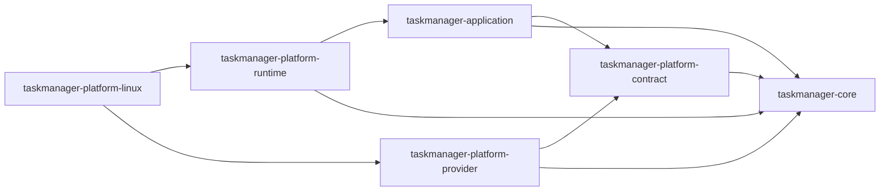

# ADR-008: Reusable platform runtime execution mechanics

Status: accepted

## Context

Every native adapter must expose the same application request facets and correlated
event contract. Reimplementing bounded queues, request validation, provider
attribution, capability health, sequence allocation, and event multiplexing in each
OS crate would make latency and failure semantics platform-dependent. Keeping those
mechanics inside the Linux adapter also made the application contracts appear reusable
without providing reusable runtime ownership.

The extraction boundary cannot move operating-system policy inward. Linux provider
IDs, provider registries, paths, commands, wall-clock wiring, hardware discovery, and
vendor features must remain in the Linux adapter. The shared crate must not become a
trait bag that merely renames provider SPI.

## Decision

`taskmanager-platform-runtime` owns the provider-to-application execution mechanism:

- one independently bounded, concrete application request lane per capability;
- a platform-neutral `CapabilityRequest` association owned by every request DTO,
  from which application submission, runtime routes, and typed lanes all derive
  the same capability ID;
- capability validation and non-blocking `Busy`/`RuntimeStopped` submission errors;
- request ID, capability, and provider attribution captured before provider execution;
- capability catalog health updates and monotonically allocated event sequences;
- separate bounded control and observation event queues;
- an alternating, control-first fair event port that prevents observation
  backpressure from delaying control and prevents sustained control from starving
  observations;
- generic lane runners for ordinary provider results, typed domain outcomes, and
  source-rich observations;
- `ObservationHealth`, which derives catalog health from the exact typed snapshot
  published to the application. `PartialSourceSnapshot`,
  `CompositeSourceSnapshot`, `DeviceSourceSnapshot`, system/process telemetry,
  and device lifecycle snapshots therefore cannot report a healthy capability
  merely because a collection is non-empty;
- generation-checked, target-keyed SMART job state and source-to-device lifecycle
  outcome mapping, both of which are OS-neutral runtime state.

The runtime consumes application request types directly. It does not add a second set
of command envelopes. Each request implements the provider- and OS-neutral
`CapabilityRequest` contract once at its application DTO boundary. `submit_request`,
catalog route construction, and `request_lane` derive the capability from that type;
none accepts a second manually editable `CapabilityId`. The public envelope still
carries and validates the ID so malformed or hostile adapters fail closed at runtime.
`RuntimeProviderBindings` is explicit optional construction data that maps each
present application capability to a provider identity; it is not an execution trait
or provider registry. An absent binding creates no descriptor, request port, or
provider-side lane. A partial/read-only/sandbox adapter therefore leaves unsupported
capabilities absent instead of installing successful-zero or always-Unsupported
stubs.

Native adapters bind an implementation, stable `ProviderId`, and application request
type through `ProviderRegistration<R, P>`. Its corresponding `ProviderBinding<R>`
preserves the request type while catalog channels are constructed, so identities
cannot be assigned across capability fields after the provider object has been erased.
The generic registration owns no provider-SPI bound and `platform-runtime` still does
not depend on `platform-provider`; each native adapter applies its provider trait while
mapping the registered object into an executor. Linux host integration is the first
complete vertical migration: its four catalog bindings and four executor objects are
derived from the same registrations, and the former duplicate provider-ID constants
have been removed from `platform_handle/bindings.rs`. Storage follows the same rule
with three deliberately distinct registrations: filesystem health, SMART observation,
and SMART control retain separate provider identities, request types, lanes, and
observation/control delivery classes. Sensor and power-supply composition is likewise
physically separate: each owns one typed registration and observation executor; the
former combined `DynamicHardwareProviders` construction bag has been removed. Service
composition retains five registrations rather than a service trait bag: inventory,
dependencies, control, log snapshot, and log stream each bind their real provider
object and identity once while preserving the control/observation delivery split.
Environment follows the same five-way boundary: startup inventory, startup evidence,
startup control, session inventory, and session control have independent registrations,
provider identities, and lanes; only the two control requests enter control delivery.
System retains seven independent registrations: host, CPU, memory, storage, network,
GPU telemetry, and hardware inventory each bind one exact provider object and request
type. The observation and auxiliary composition groups do not create an aggregate
provider interface or shared execution lane.
Process completes the same migration with eight registrations: list, general control,
network, GPU, resources, isolation, affinity observation, and affinity control.
Observation/control groups remain scheduling structure only; they neither flatten the
registered objects into a provider bag nor merge their typed lanes.

An adapter that claims the complete standard product surface must consume
`ChannelRuntime::try_complete`. Success returns `CompleteChannelRuntime` and
non-optional `CompleteRuntimeLanes`; failure returns a `CompositionError` listing every
missing capability and drops the incomplete handle before it can escape. Linux
propagates that error through `spawn` and `spawn_with_providers`. GPUI records the
startup failure and quits; TUI returns an I/O
error. Composition drift can therefore never produce registered request ports without
their provider workers.

The optional construction surface and complete execution surface are grouped by
application domain, not exposed as one positional tuple of 26 receivers.
`Pending*RuntimeLanes` retains absence until composition is proven, while the
corresponding complete domain group contains only non-optional receivers.
Domain executor bundles contain injected closures over application payloads;
they do not depend on the provider SPI. Native adapters are the only layer that
adapts provider objects into those closures.

Process Insights follows the same rule at domain granularity: network, GPU,
resources, and isolation each have a typed observation lane and executor. No
aggregate `process.insights` capability, request queue, or complete-composition lane
exists.

The complete surface currently has eight groups: `System`, `Process`, `Service`,
`Environment`, `Integration`, `Storage`, `Sensor`, and `Power`. Construction
proximity does not merge domain semantics: for example, Linux may discover
sensors and power supplies together, but it immediately produces independent
executor groups because they have different request types, lifecycle authority,
health, and future replacement cadence. Storage likewise groups filesystem
health and SMART only at the application domain boundary while retaining three
independent lanes and separate observation/control executors.

Each native adapter injects:

- provider identities;
- queue configuration and a wall-clock function;
- its platform provider registry;
- the blocking execution closure attached to each typed lane.

The runtime exposes one `NativeProviderSet`/`RuntimeExecutors` assembly seam for
that final wiring. Native crates still derive bindings and executors from their
own typed registries; the shared seam only proves complete lanes, starts the
eight domain worker groups, and attaches their lifetime to the returned handle.

Linux therefore retains `linux.*` provider IDs, `SystemTime` wiring, provider registry
construction, `/proc` and `/sys` access, native commands, error classification, and
hardware runtime discovery. Its `platform_handle` module is consequently only a
bindings/composition root; provider objects are adapted to shared executors under the
Linux backend edge rather than by duplicate request handlers. Windows and macOS
adapters reuse the runtime's
capability-absent handle without depending on Linux, native target selection,
provider implementations, or a frontend; real facets can adopt optional runtime
lanes independently as native providers arrive.

The production dependency edges are:

The architecture guard requires the runtime manifest and source to remain free of
platform-linux, platform-native, provider implementations, frontends, OS `cfg`,
native paths/commands, Linux provider IDs, and vendor binaries/features. It also
requires the Linux adapter to construct and `try_complete` `ChannelRuntime`, rejects
silent `return handle` fallback, verifies frontend-host error propagation, and rejects
the retired Linux-local command, port, support, and SMART-state duplicates.

## Consequences

Control/observation fairness, request backpressure, correlation, and capability health
now have one reusable implementation and one regression surface across native
adapters. Adding an adapter still requires real provider implementations and explicit
provider attribution, but it no longer requires recreating the application runtime.

The runtime has a deliberate dependency on application payloads. It is not a lower
level replacement for `taskmanager-platform-contract`; it is the reusable execution
layer immediately outside application. Provider SPI remains independently reusable
and contains no channel or application orchestration policy. In particular, the
runtime must not depend on `taskmanager-platform-provider`: doing so would turn native
provider interfaces into shared execution policy and force adapters to inherit each
other's trait-object composition.

This extraction does not claim that every Linux runtime helper is portable. Provider
execution, wall-clock and filesystem semantics, native configuration paths, hardware
registries, and vendor integrations remain at the OS edge until another adapter
demonstrates an equivalent abstraction.
