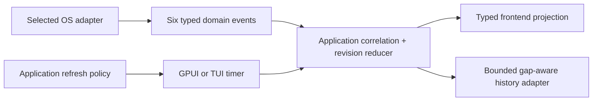

# ADR-014: Correlated telemetry history and refresh-policy ownership

Status: accepted

## Context

System telemetry is now collected and scheduled as six independent host, CPU,
memory, storage, network, and GPU capabilities. The application layer owns the
refresh revision and rejects stale, duplicate, mismatched, or lifecycle-conflicting
domain events before a frontend can consume them.

The previous aggregate collector left two responsibilities in the wrong place:

- Linux composition created the shared telemetry-history store and returned it
  beside the application ports;
- a Linux `TelemetryControlProvider` mutated the store's pause and interval state,
  even though GPUI and TUI are the components that schedule refresh requests.

That arrangement makes a frontend scheduling policy appear to be an operating-system
capability. It also forces every OS adapter to depend on the history implementation
and allows a provider-side collector to write history before application correlation.
Neither dependency remains valid after the six-domain split.

## Decision

System observation, refresh policy, and history projection have separate owners.

1. Physical OS adapters implement on-demand observation and device-control ports.
   They do not own a frontend refresh interval, pause state, graph history, or an
   aggregate telemetry clock.
2. The application/frontend composition owns a typed refresh policy. GPUI and TUI
   use the same interval and pause semantics while retaining their own timer/event
   loop. Applying a policy change is local application behavior, not a Linux,
   Windows, or macOS provider operation.
3. `taskmanager-telemetry-store` is a bounded read-model adapter with a separately
   constructed correlated-ingestion capability. It may depend inward on
   `taskmanager-core` observation types, but never on application, provider,
   runtime, native-adapter, or frontend crates. A read store cannot derive a writer.
4. History ingestion happens only after `PlatformClient` has accepted correlation
   for a system-domain event. Raw provider completion cannot write history.
   Dependency firewalls prevent platform crates from using the store as a shortcut.
5. Every history slot preserves observation truth. Current values append
   `Some(value)`; unavailable, stale, absent, or unknown facts append an explicit
   gap. A missing value is never converted to zero and never repeats the previous
   value as if it were current.
6. Device histories are keyed by stable `DeviceId` and lifecycle generation.
   Reappearance with a new generation starts a new rate baseline; absent and expired
   devices cannot inherit samples from the previous physical lifetime.
7. The complete `SystemSnapshot` render model is updated only when all six domains
   can construct an honest current snapshot. Typed per-domain projection remains
   the authoritative state during partial, stale, pending, and unavailable refreshes.
8. History accepts non-zero revisions that increase independently per domain and
   rejects impossible completion-before-measurement timestamps. Old, duplicate, or
   impossible outcomes fail closed without appending. GPUI retains the latest 32
   typed ingestion rejections as read-model diagnostics; they are not relabeled as
   provider failures.

## Implemented migration

The boundary was migrated in dependency order:

1. add typed, gap-aware, lifecycle-aware domain ingestion to the history crate;
2. make GPUI retain the authoritative system projection and ingest only events
   already present in the correlated application batch;
3. move interval and pause state to an application refresh-policy reducer used by
   both frontends;
4. remove `TelemetryControlProvider`, its runtime lane and provider binding;
5. remove `spawn_with_telemetry` and the telemetry-store dependency from Linux,
   Windows, and macOS adapters;
6. delete the test-support aggregate `MetricsCollector` facade and implementation;
7. migrate every GPUI system graph to `CorrelatedSystemTelemetryHistory`, including
   exact `(DeviceId, generation)` lookup and explicit gaps, then delete the parallel
   uncorrelated history fields and their writerless constructor;
8. delete the aggregate telemetry request/event port, raw event-batch queues, frontend
   fallbacks, and aggregate lifecycle partition. `SystemSnapshot` remains only the
   complete read model materialized by the six-domain projection.

Architecture tests prevent the deleted platform control/store dependency, parallel
history authority, aggregate request/event contract, raw queues, and aggregate
lifecycle entry point from returning.

## Consequences

One platform artifact still contains every hardware backend supported by that OS and
selects them at runtime. This decision changes ownership, not the platform/hardware
axis.

GPUI and TUI can refresh at different cadences without changing provider traits.
Slow storage or GPU work cannot become a shared timer barrier. Histories accurately
show gaps and device generations, while platform crates become independent of the
chosen frontend history implementation.

This decision does not claim final GUI, AT-SPI, pixel, or target-hardware acceptance.
Those evidence runs remain in the final validation phase.
